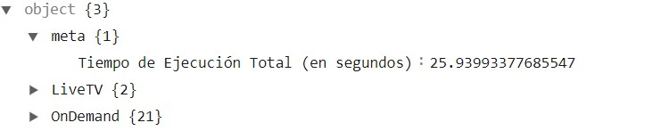
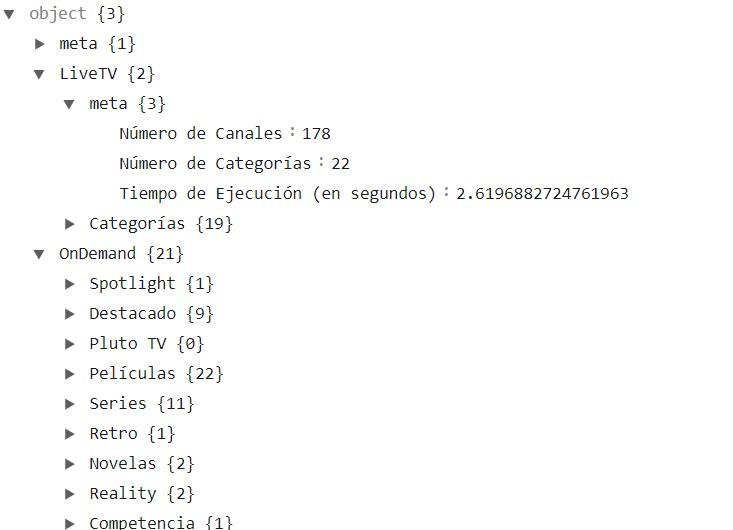
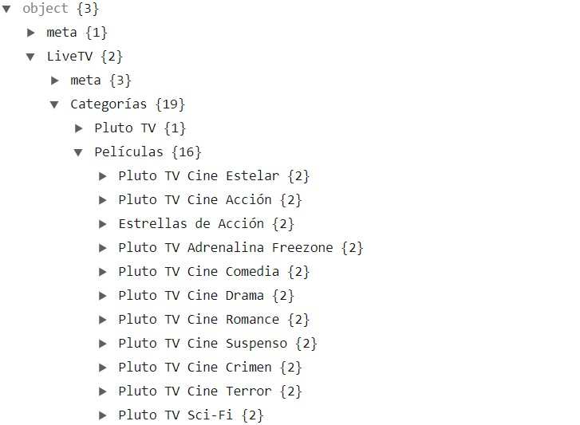
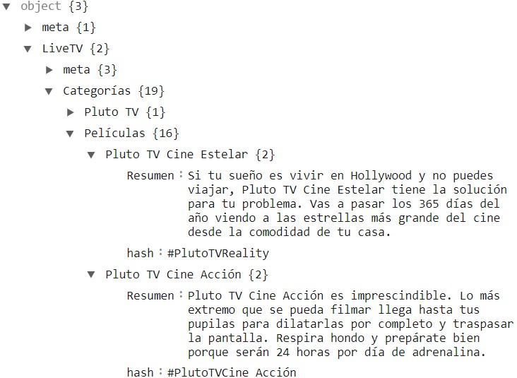
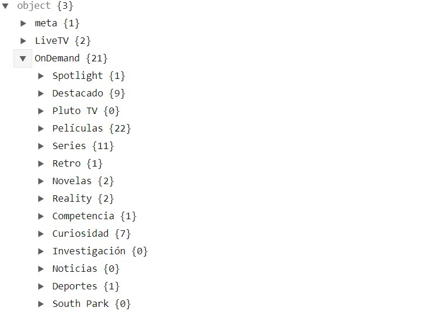
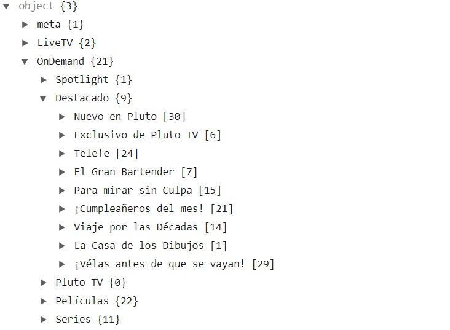
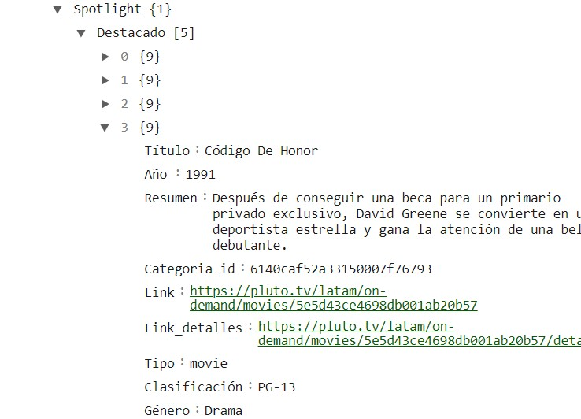

# Scrapeo plataforma de streaming "PlutoTV".

  

## Índice.

1. Introducción.
2. Descripción del archivo .json.
   - Imagen 1: Claves "meta" y "categorías".
   - Imagen 2: Valores de "meta" y categorías.
   - Imagen 3: Valores de las claves de cada canal.
3. Imagen de la plataforma.

## 1. Introducción.

- El link de la página es el siguiente: "https://pluto.tv/latam/live-tv/5dcdde78f080d900098550e4?lang=en".
- Se hizo el scrapeo utilizando la API de la página, se utilizaron headers con autorizaciones para evitar el error 401.
- El tiempo de ejecución está en meta, dentro del archivo.json (El máximo tiempo de ejecución fue de menos de 40 segundos).
- Se dividieron los canales (Live TV) por categorías. Se usan claves y valores para ordenar los datos en el .json. Incluyen Nombre, Resumen y hash.
- Se dividieron las series y películas (On Demand) por categorías y subcategorías.Se usan claves y valores para ordenar los datos en el .json. Incluyen Título, Año, Resumen, categoría_id, Link, Tipo, Clasificación y Género.

## 2. Descripción del archivo .json.

### Imagen 1: Claves "meta" , "LiveTV" y "OnDemand":
-En meta podemos ver el tiempo de ejecución.

  

### Imagen 2: Valores de "LiveTV" y "OnDemand":
- En la segunda imagen podemos ver los valores de "LiveTV" y "OnDemand", también el número de canales y categorías de la sección "LiveTV", y en "OnDemand" las categorías.

  

### Imagen 3: Valores de las categorías de "LiveTV":
- Podemos ver las dos primeras categorías y denotar que la categoría Películas cuenta con 16 valores.

  

### Imagen 4: Valores de las categorías de "LiveTV":
- Podemos ver la data del canal "Pluto TV Cine Estelar".

  

### Imagen 5: Categorías "On Demand":
- Podemos ver que se conforma por 21 categorías y el número de subcategorías de cada categoría.

  

### Imagen 6: Subcategorías "On Demand":
- Notamos las subcategorías de la categoría "Destacado" y el número de títulos por cada subcategoría, por ejemplo la subcategoría "Nuevo en Pluto" tiene 30 títulos.

  

### Imagen 7: Valores o Títulos de la Subcategoría "On Demand":
- Podemos ver que los valores del Título, Año, Resumen, Categoría_id, Links, Tipo, Clasificación y Género.

  

## 8. Imagen de la plataforma "Live TV".

  

## 9. Imagen de la plataforma "On Demand".

  

