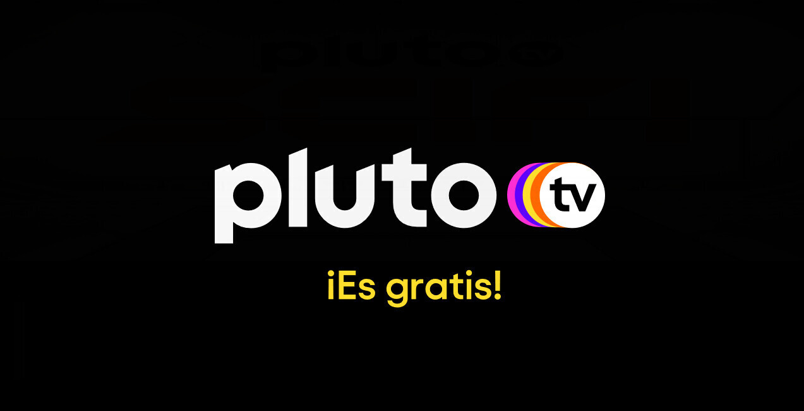
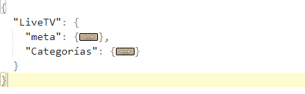

# Scrapeo plataforma de streaming "PlutoTV".

  

## Índice.

1. Introducción.
2. Descripción del archivo .json.
   - Imagen 1: Claves "meta" y "categorías".
   - Imagen 2: Valores de "meta" y categorías.
   - Imagen 3: Valores de las claves de cada canal.
3. Imagen de la plataforma.

## 1. Introducción.

- El link de la página es el siguiente: "https://pluto.tv/latam/live-tv/5dcdde78f080d900098550e4?lang=en".
- Se hizo el scrapeo utilizando la API de la página, se utilizaron headers con autorizaciones para evitar el error 401.
- El tiempo de ejecución está en meta, dentro del archivo.json (El máximo tiempo de ejecución fue de menos de 40 segundos).
- Se dividieron los canales por categorías. Se usan claves y valores para ordenar los datos en el .json.

## 2. Descripción del archivo .json.

### Imagen 1: Claves "meta" y "categorías":
-En la primera imagen podemos ver que está dividido en dos claves que son "meta" y "categorías".

  

### Imagen 2: Valores de "meta" y "categorías":
- En la segunda imagen podemos ver los valores de "meta" y las categorías, entre ellos se encuentra el tiempo de ejecución del script. "El máximo que me dio en otras pruebas fue de alrededor de 35 segundos".

  

### Imagen 3: Valores de las claves de cada canal:
- En la última imagen podemos ver los valores que tienen las claves de cada canal.

  

## 3. Imagen de la plataforma.

  

